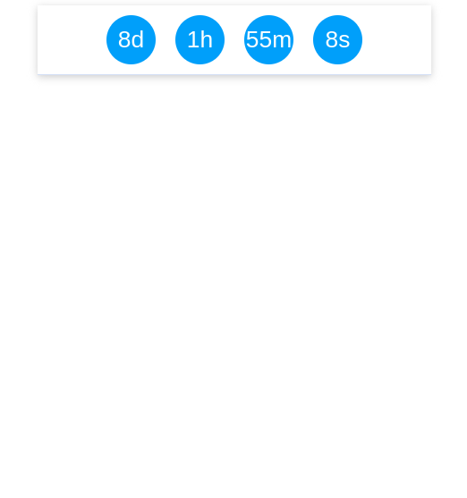

<h1 align="center">
   ⏳ Contador Regressivo
</h1>

---

## 📝 Projeto

Um simples contador regressivo em JavaScript que exibe o tempo restante até uma data final específica em formato de dias, horas, minutos e segundos.

---

## 🎬 Demo

<div align="center" >
   
</div>

---

## Como Usar

- Clone ou faça o download do repositório.

```
git clone https://github.com/pcaldi/contador-regressivo.git

```
---

- Abra o arquivo index.html em seu navegador.

---

## Personalização
Se desejar ajustar a data final ou o formato de exibição, você pode editar o arquivo main.js no diretório js. Procure pela seção "Adicione 8 dias à data atual" e ajuste os valores conforme necessário


```
const dataFinal = new Date(dataAtual);
dataFinal.setDate(dataFinal.getDate() + 8);
```

